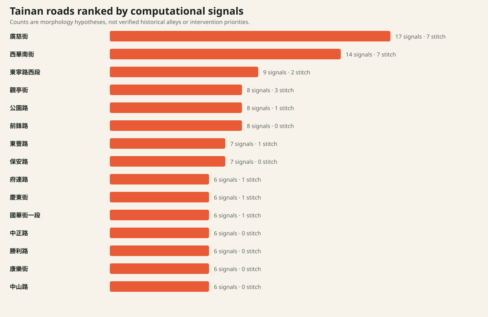
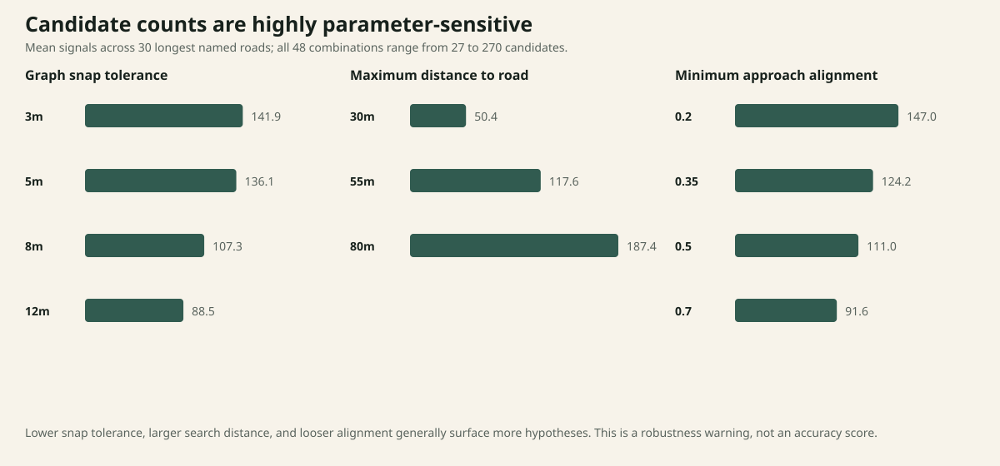

# City Diff — From Residual Space to Urban Evidence

## 一個用於提出與檢查台南城市斷裂假設的人機協作研究工具

### 摘要

2021 年的建築論文《不完美的城市》將台南歷史核心的畸零地與殘餘空間，理解為不同時代的街道、地塊與社群系統重疊後留下的結果，並提出分散式微型介入。City Diff 在 2026 年重新檢查這個前提：當資料不完整、歷史圖資是點陣影像、現代路網又不代表法律權利時，軟體如何提出有用的城市假設，而不製造虛假的確定性？

本研究以台南中西區與北區歷史核心為範圍，使用有來源紀錄的 OSM 具名道路與步行路網、中央研究院四個歷史圖層，以及文化部登錄古蹟資料。程式將當代步行路網轉為圖結構，尋找朝向選定道路卻提前中止的端點，並配對距離近但現況繞行明顯的端點。全區 401 條具名道路中，193 條出現至少一個形態訊號；系統產生 448 個「道路—端點」關聯，對應 379 個獨立端點，另有 30 個縫合關聯。

48 組參數敏感度測試顯示，在固定 30 條長道路上，候選總數由 27 到 270，差距達十倍。這否定了把結果當作客觀清單的做法，也支持本研究最重要的設計結論：演算法應該是可調整、可質疑的假設生成器；歷史影像、現況與制度資料必須留給人來交叉判讀。

## 1. 從 2021 的設計命題，到 2026 的可測試問題

原論文的命題是：「許多小型、脈絡化的介入，能否修補大型都市發展造成的問題？」其中包含三個尚未被充分驗證的假設：

1. 可見的殘餘空間確實源自不同都市系統的衝突，而非一般地塊細分、私有通道或製圖差異。
2. 幾何上的破碎與公共價值之間存在足夠強的關係，值得用來選擇介入位置。
3. 設計者能從圖資辨識「需要修補」的地方，且不會忽略權屬、使用方式與在地知識。

City Diff 不再直接提出設計方案，而先研究證據如何成立。

**研究問題**

> 一個人機協作的空間分析工具，能否把當代路網中的斷裂形態轉化成可檢查的歷史假設與縫合候選，同時避免把計算代理指標誤認為城市事實？

**研究定位**

這是一個 computational design research instrument 與 urban evidence interface，不是畸零地法規判定器、都市開發評分器，也不是自動設計生成器。

## 2. 證據模型

City Diff 將資料分成三層：

| 層級 | 定義 | 目前例子 |
|---|---|---|
| Observed｜觀察資料 | 來源直接提供、可追溯的紀錄 | 歷史圖磚、OSM 中心線、文化部古蹟點位 |
| Derived｜程式推導 | 可由固定輸入與參數重現 | 道路長度、端點距離、方向相似度、最短路徑與繞行比 |
| Unknown｜尚未知道 | 目前資料不能支持的主張 | 歷史因果、公共通行、權屬、現況使用、介入可行性 |

這個分類不是介面說明文字，而是整個產品的倫理與方法核心：使用者永遠能看見系統知道什麼、如何推得，以及仍缺少什麼。

## 3. 資料與研究範圍

- **範圍：** 台南中西區與北區歷史核心，約由 120.187–120.219°E、22.982–23.008°N 界定。
- **具名道路：** OSM Overpass 快照，資料時間 2026-08-09；931 個線段、401 個道路名稱。
- **步行路網：** OSM Overpass 快照，資料時間 2026-08-10；4,800 個線段，含具名與無名的道路、服務道路、步道、階梯與 path；明確標示 `access=private` 者排除。
- **歷史圖：** 中央研究院 1953 地籍圖、1970 年代地形圖、1984 市街圖、2016 地籍圖 WMTS。
- **文化脈絡：** 文化部文化資產局登錄古蹟資料；點位用於鄰近探索，不用於推論因果。

所有資料擷取時間、篩選規則、授權與 SHA-256 都保存在 `public/data/*.meta.json`。歷史圖是 georeferenced raster，不是可直接查詢的向量地籍。

## 4. 計算方法

### 4.1 巷弄痕跡候選

1. 將步行路網座標投影到局部公尺座標。
2. 以 8 公尺容差合併近接節點，建立無向圖。
3. 找出圖中 degree = 1、且不在研究框裁切邊界附近的端點。
4. 端點需距選定道路 3–55 公尺。
5. 端點朝向道路的 cosine alignment 需 ≥ 0.35。
6. 12 公尺內的重複端點只保留方向分數較高者。

輸出是 `morphology_candidate`，不是「曾經存在的巷弄」。

### 4.2 城市縫合候選

1. 從同一選定道路周邊的端點候選中尋找相向配對。
2. 兩端對道路的投影位置需相距 ≤ 90 公尺，端點直線間距為 8–130 公尺。
3. 以路網最短路徑比較直線距離；繞行比 ≥ 2.5，或額外距離 ≥ 180 公尺，才保留。
4. 路徑不存在時保留為 disconnected candidate。

輸出是 `connectivity_candidate`，不代表可以實際打通。

### 4.3 批次研究與案例選擇

相同分析依序套用到 401 條具名道路。案例不是人工挑選最好看的畫面，而由可重現規則產生：

- **High-signal case：廣慈街**——17 個關聯（10 個端點、7 個縫合），道路長 307 公尺。
- **Median-positive comparison：民生路二段**——2 個端點關聯，道路長 2,672 公尺。
- **Length-matched zero-signal control：成功路**——0 個關聯，道路長 4,001 公尺。

控制案例很重要：它讓作品不是只展示演算法「找到東西」的畫面，也能討論何時與為何沒有輸出。

## 5. 結果

### 5.1 全區掃描

- 401 條具名道路被分析。
- 193 條（48.1%）至少出現一個形態或連通訊號。
- 448 個道路—端點關聯，對應 379 個獨立端點。
- 30 個縫合關聯，對應 30 組獨立端點配對。
- 原始關聯數最高的五條道路為廣慈街 17、西華南街 14、東寧路西段 9、觀亭街 8、公園路 8。

這個排序只是「演算法對哪些道路提出較多問題」，不是公共價值、歷史重要性或投資優先序。短道路也可能因周邊端點密集而得到很高的每公里值，因此 CSV 同時保留原始數量與 `signals_per_km`，但兩者都不等於價值分數。

### 5.2 參數敏感度

在 30 條最長的具名道路上，測試：

- 節點合併容差：3、5、8、12 公尺。
- 搜尋道路最大距離：30、55、80 公尺。
- 最低方向相似度：0.2、0.35、0.5、0.7。

共 48 組。基準參數產生 115 個候選關聯，所有組合的範圍是 27–270。

三組單一參數的平均結果顯示：

- 搜尋距離的影響最大：30、55、80 公尺分別平均產生 50.4、117.6、187.4 個關聯。
- 節點容差增大時平均候選下降：3 公尺為 141.9，12 公尺為 88.5。
- 方向條件變嚴時平均候選下降：0.2 為 147.0，0.7 為 91.6。

這不是 accuracy test，因為目前沒有 ground truth。它測的是模型穩定性，結果表明候選清單高度依賴研究者的空間尺度選擇。

## 6. 研究發現

### 發現一：最困難的不是偵測，而是命名

同一個端點可能是歷史巷弄殘跡，也可能是服務道路、封閉通道、OSM 缺漏或研究框裁切效果。把它命名為「消失巷弄」會先替證據下結論；把它命名為「巷弄痕跡候選」才保留研究空間。

### 發現二：參數就是設計立場

55 公尺不是中性的真理。搜尋距離決定系統把多大範圍理解為與道路有關，節點容差決定什麼算連接，方向門檻決定什麼算「朝向」。介面與作品集必須公開這些選擇，而不是只展示漂亮的紅點。

### 發現三：公共價值不能由幾何直接推出

幾何可以縮小調查範圍，卻不能判定通行權、居民需求、歷史連續性或介入是否值得。City Diff 的合理角色是 triage：把 4,800 段路網轉成一組可檢查的問題，而不是替城市做最後決策。

### 發現四：失敗案例是必要輸出

成功路在基準參數下沒有候選。這不表示它沒有都市影響，只表示目前代理指標沒有發現指定形態。顯示零結果與限制，比強迫每條路都產生建議更可信。

## 7. 研究貢獻

1. **方法貢獻：** 把建築論文中的形態直覺轉成可重現、可調參數、可被反駁的計算規則。
2. **介面貢獻：** 將同一座標的歷史圖、現代路網、文化紀錄與推導候選放在一個證據工作流中。
3. **批判貢獻：** 用敏感度分析證明自動偵測結果不是客觀真相，並將不確定性設計成產品功能。
4. **個人方法轉變：** 從 2021 年直接提出空間介入，轉向 2026 年先檢查「為什麼我們相信這裡需要被介入」。

## 8. 不能從本研究得出的結論

- 379 個端點不是 379 條已證實消失的巷弄。
- 30 個縫合配對不是 30 個可施工的公共空間提案。
- 古蹟在 500 公尺內不代表歷史因果或社群需求。
- OSM 中心線不代表法律道路、所有權或完整步行可達性。
- 點陣地籍圖不能直接替代法定向量地籍資料判定畸零地。
- 本研究沒有完成訪談、現勘或歷史圖逐點標註，因此不宣稱 precision / recall。

## 9. 下一步

若只有極少時間，最有價值的下一步不是加功能，而是依 `REVIEW_PROTOCOL.md` 查核 6 個點：2 個高訊號、2 個一般訊號、2 個零／反例。若能投入更多時間，再完成 30 點人工標註、跨標註者一致性與歷史圖對照，才適合討論模型精確度。
